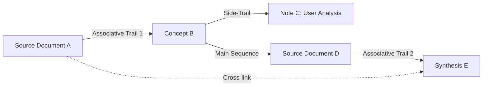

# Associative Trails

## Definition
An **Associative Trail** is a non-linear, multi-hop pathway linking diverse pieces of information across a knowledge base based on conceptual relationships rather than rigid taxonomic or alphabetical classifications. Coined by [[vannevar-bush|Vannevar Bush]] in 1945 for the [[memex|Memex]], associative trails mirror the natural associative mechanics of human cognition.

## Key Mechanics
1. **Associative vs. Categorical Indexing:** Categorical filing forces an item into a single hierarchical container (e.g., `Folder/Subfolder/Item`). Associative trails allow an item to participate simultaneously in dozens of overlapping pathways.
2. **Side Trails & Annotations:** Explorations can branch off to investigate tangentially related physical constants, historic parallels, or user-authored annotations without disrupting the primary trail.
3. **Permanence & Non-Degradation:** Unlike biological memory traces that fade over time, externalized digital trails persist indefinitely in markdown vaults.
4. **Trail Compilation in LLM Wikis:** In traditional digital PKMs (e.g., standard [[obsidian]] vaults), the human user must manually insert every wikilink. In an **LLM Wiki**, the LLM agent analyzes inbound documents, discovers underlying connections, and constructs bidirectional associative trails automatically.

## Evolution of Trails Across Paradigms

| Era | Implementation | Trail Creation | Maintenance Overhead |
|---|---|---|---|
| **1945 (Memex)** | Microfilm projection & code levers | Manual electro-mechanical linking | High (Physical code books) |
| **1960s–80s (Zettelkasten)** | Index cards & alphanumeric Folgezettel | Manual pen-and-paper card filing | High (Physical filing) |
| **1990s–2010s (Web & Wikis)** | HTML `<a>` tags & MediaWiki links | Manual manual markup / link insertion | Medium-High (Link rot, orphan pages) |
| **2020s (Obsidian / PKM)** | Bidirectional `[[wikilinks]]` | Manual typing by human author | Medium (Bookkeeping friction) |
| **2026+ (LLM Wiki)** | Agentic persistent markdown compilation | **Autonomous LLM curation & linking** | **Near Zero** |

## Connected Pages
- [[as-we-may-think-bush-1945]]
- [[vannevar-bush]]
- [[memex]]
- [[persistent-knowledge-bases]]
- [[memex-to-llm-wiki-evolution]]
