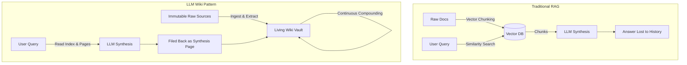

# Persistent Knowledge Bases vs Query-Time RAG

## Definition
A **Persistent Knowledge Base** is an evolving, pre-compiled, and cross-referenced body of structured text (typically markdown files) where connections, entities, and conceptual syntheses are explicitly linked and maintained over time.

In contrast to traditional **Query-Time RAG** (Retrieval-Augmented Generation), which searches raw fragmented chunks and derives insights from scratch on every user prompt, a persistent knowledge base accumulates value with every ingested document and answered query.

## Core Mechanics
1. **Incremental Compilation:** When a new paper or note is ingested, it is synthesized against the existing body of knowledge, updating entity and concept pages rather than simply creating isolated embeddings.
2. **Explicit Cross-Referencing:** Concepts point directly to one another via double bracket `[[wikilinks]]`.
3. **Contradiction Resolution:** If Document B disputes an assertion made by Document A, the tension is explicitly noted on the relevant concept page rather than hallucinated over in a vector retrieval window.
4. **Answer Compounding:** High-value answers and exploratory comparisons generated during queries are saved back into `wiki/syntheses/`.

## Associated Entities & Sources
- Discussed in detail in [[llm-wiki-concept]].
- Historical foundation established by [[vannevar-bush]] in [[as-we-may-think-bush-1945]].
- Implements non-linear [[associative-trails]] across structured markdown.
- Visualized in [[obsidian]].
- Comparative synthesis available at [[rag-vs-llm-wiki]] and [[memex-to-llm-wiki-evolution]].
