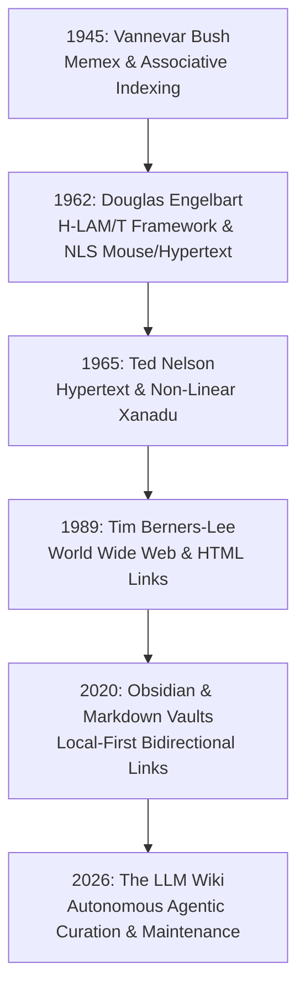

# From Bush and Engelbart to LLM Agentic Co-Intelligence

## Executive Thesis
The modern [[llm-wiki-concept|LLM Wiki]] is the direct realization of a grand 80-year intellectual lineage pioneered by **Vannevar Bush (1945)** and **Douglas Engelbart (1962)**. 

While Bush conceived the vision of non-linear [[associative-trails|associative trails]] and Engelbart engineered the [[h-lam-t-system|H-LAM/T architecture]] for human-computer symbiosis, both systems required the human to perform continuous, laborious manual symbol manipulation. By introducing autonomous LLM agents into the *Artifact* and *Methodology* layers, the LLM Wiki completes the cognitive augmentation loop without succumbing to the historical "Maintenance Tax".

---

## The Great Lineage of Cognitive Augmentation

---

## Tri-System Synthesis: Bush vs. Engelbart vs. LLM Wiki

| Dimension | Vannevar Bush (Memex, 1945) | Douglas Engelbart (H-LAM/T, 1962) | The LLM Wiki (2026) |
|---|---|---|---|
| **Core Goal** | Rescue researchers from information overload; preserve associative trails | Augment human problem-solving capability across complex domains | Compound personal/domain knowledge into an active, self-maintaining second brain |
| **System Model** | Electro-mechanical microfilm desk & coded levers | Integrated Human + Language + Artifacts + Methodology + Training | Human (Intuition/Curation) + LLM Agent (Librarian/Architect) + Obsidian (IDE) |
| **Information Structure** | Microfilm pages with code spaces | Multi-level text hierarchies and viewspecs | Bidirectional markdown graph with YAML frontmatter schemas |
| **Bottleneck Encountered** | Physical engineering limits of 1940s microfilm | High training threshold; manual typing and link maintenance | Requires disciplined agent schema (`AGENTS.md`) and verified ground truth |
| **Compounding Driver** | Manual user trail creation | Bootstrapping (tools designing better tools) | **Autonomous multi-page propagation on every ingest & query** |

---

## The Bootstrapping Dynamic in Practice

Engelbart emphasized **Bootstrapping**—using your cognitive tools to build better cognitive tools. In the context of the LLM Wiki:

1. **Ingestion Compounding:** Ingesting a paper on graph theory improves the agent's vocabulary and conceptual linkages.
2. **Tool Evolution:** Adding scripts like [python/wiki_search.py](file:///c:/Users/user/Documents/GitHub/ilk-repo/python/wiki_search.py) and [python/wiki_lint.py](file:///c:/Users/user/Documents/GitHub/ilk-repo/python/wiki_lint.py) makes the vault faster and more reliable for future ingests.
3. **Query Compounding:** Every synthesis page filed back into `wiki/syntheses/` serves as a high-density springboard for subsequent, higher-order inquiries.

---

## Conclusion

The LLM Wiki does not replace human cognition; it fulfills Engelbart's definition of true augmentation:
> *"Increasing the capability of a man to approach a complex problem situation, to gain comprehension to suit his particular needs, and to derive solutions to problems."*

By pairing human strategic curiosity with autonomous agentic librarianship, personal knowledge bases transform from static archives into dynamic intellectual partners.

---

## Connected Pages
- [[as-we-may-think-bush-1945]]
- [[augmenting-human-intellect-engelbart-1962]]
- [[vannevar-bush]]
- [[douglas-engelbart]]
- [[memex]]
- [[h-lam-t-system]]
- [[associative-trails]]
- [[memex-to-llm-wiki-evolution]]
- [[persistent-knowledge-bases]]
- [[obsidian-llm-wiki-guide]]
