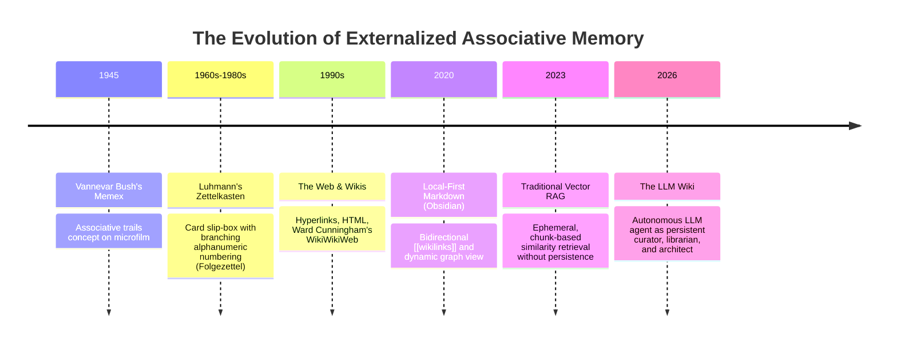

# From Memex to LLM Wiki: Solving the Knowledge Maintenance Bottleneck

## Executive Problem Statement
For over eighty years since [[vannevar-bush|Vannevar Bush]] conceptualized the [[memex|Memex]] in 1945, humanity has pursued systems that augment human thought through non-linear, associative connections. However, every historical knowledge management paradigm—from Niklas Luhmann's physical **Zettelkasten** to **digital wikis** and **Obsidian PKMs**—has crashed into the same fundamental ceiling: **The Maintenance Tax**.

As a knowledge base expands, the manual effort required to link notes, reconcile contradictions, index concepts, and prevent link decay grows exponentially, eventually outpacing the human user's capacity to sustain it.

The **LLM Wiki** represents an architectural paradigm shift that dissolves this maintenance bottleneck.

---

## The Historical Continuum: 80 Years of Associative Thought



---

## Deep Comparison Matrix: The 5 Generations of Knowledge Management

| Dimension | 1. Memex (1945) | 2. Zettelkasten (1960s-80s) | 3. Obsidian / PKM (2020) | 4. Vector RAG (2023) | 5. LLM Wiki (2026) |
|---|---|---|---|---|---|
| **Storage Medium** | Microfilm & Desk mechanics | Physical paper cards in wooden boxes | Plaintext Local Markdown files | Vector Embeddings in Database | Plaintext Local Markdown Vaults |
| **Associative Mechanism** | Mechanical code indexing | Manual alphanumeric branching codes | Bidirectional `[[wikilinks]]` | Cosine similarity across chunk embeddings | Autonomous Bidirectional `[[wikilinks]]` |
| **Who Links & Indexes?** | Human Operator | Human Researcher | Human Author | Mathematical Vector Search | **Autonomous LLM Agent** |
| **Cross-Document Synthesis** | User must project and view manually | User manually shuffles card boxes | User manually inspects notes | LLM combines retrieved chunks at runtime | LLM pre-compiles and compounds living synthesis pages |
| **Contradiction Management** | Manual user annotations | Manual card notes | Manual user refactoring | Fails / Competes in prompt window | **Explicitly flagged & documented by Agent** |
| **Failure Mode** | Physical hardware limitations | Card proliferation & indexing fatigue | **"Maintenance Tax" abandonment** | Chunk hallucination, zero compounding | Requires disciplined schema & oversight |

---

## Why Previous Systems Stalled: The "Maintenance Tax"

Why did personal wikis and complex note vaults historically fail?

1. **Quadratic Link Complexity:** Adding the $N$-th note requires checking against $(N-1)$ existing notes. For $N=500$, the manual effort becomes prohibitive.
2. **Cognitive Divergence:** Humans read for insight and curiosity; tedious filing, tag formatting, and YAML frontmatter curation interrupt flow state.
3. **Link Rot & Stale Claims:** When new evidence refutes old knowledge, humans rarely trace backward to update every historical note.

---

## How the LLM Wiki Solves the Maintenance Bottleneck

The LLM Wiki succeeds by introducing a strict division of labor between Human and Agent:

```mermaid
flowchart TD
    subgraph Human Role (High-Leverage)
        H1[Source Curation]
        H2[Inquiry & Direction]
        H3[Intuition & Thesis Formation]
    end

    subgraph LLM Agent Role (Zero-Friction Maintenance)
        A1[Deep Extraction & Summarization]
        A2[Cross-Document Wikilinking]
        A3[Contradiction Reconciliation]
        A4[Vault Health Auditing & Linting]
        A5[Index & Log Compounding]
    end

    HumanRole -->|Directs / Curates| LLMAgentRole
    LLMAgentRole -->|Updates Knowledge Graph in Obsidian| HumanRole
```

1. **Zero Marginal Bookkeeping:** An LLM agent can read a 50-page paper, generate a structured source note, create 3 entity pages, update 4 concept pages, and add backlinks in seconds.
2. **Persistent Compounding:** Exploratory inquiries do not vanish into chat history; they are saved into `wiki/syntheses/` and woven into the graph.
3. **Transparent Verifiability:** Unlike black-box vector databases, all compiled knowledge is human-readable markdown, inspected in real-time inside [[obsidian]] with graph visualization.

---

## Conclusion

Vannevar Bush famously stated in 1945: *"There is a new profession of trail blazers, those who find delight in the task of establishing useful trails through the enormous mass of the common record."*

The LLM Wiki fulfills this 80-year-old prophecy by turning the LLM agent into that **tireless trail blazer**, transforming static information repositories into a living, compounding digital extension of the human mind.

---

## Connected Pages
- [[as-we-may-think-bush-1945]]
- [[llm-wiki-concept]]
- [[persistent-knowledge-bases]]
- [[rag-vs-llm-wiki]]
- [[obsidian-llm-wiki-guide]]
- [[vannevar-bush]]
- [[memex]]
- [[associative-trails]]
