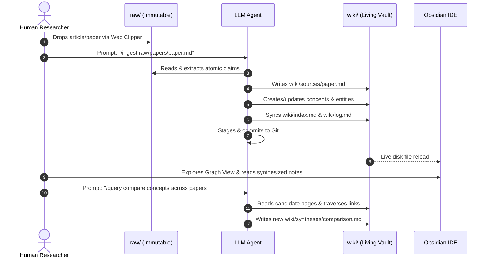

# Guide: Obsidian & The LLM Wiki Paradigm

## 1. The Core Mental Model

In traditional Personal Knowledge Management (PKM), the human is responsible for all cognitive and bookkeeping overhead: finding sources, reading, summarizing, manually creating hyperlinks, updating index files, formatting frontmatter, and filing notes. Over time, this **Maintenance Tax** grows quadratically ($O(N^2)$), causing researchers to abandon their vaults.

The **LLM Wiki** divides labor along natural cognitive and mechanical strengths:

```text
┌────────────────────────────────────────────────────────┐
│                   HUMAN USER                           │
│  - Curates raw sources (Articles, Papers, Transcripts) │
│  - Directs high-level inquiries & research hypotheses   │
│  - Explores visual graph topologies in Obsidian        │
└───────────────────────────┬────────────────────────────┘
                            │
              Markdown Vault (Disk Interface)
                            │
┌───────────────────────────▼────────────────────────────┐
│                    LLM AGENT                           │
│  - Ingests raw text & extracts atomic facts            │
│  - Builds & maintains living pages in wiki/            │
│  - Links concepts automatically via [[wikilinks]]      │
│  - Resolves tensions, updates index.md, and logs audits│
└────────────────────────────────────────────────────────┘
```

> **The Analogy:**
> - **Obsidian** is your **IDE** (like VS Code for thought).
> - **The LLM Agent** is your **Programmer / Senior Librarian**.
> - **The Wiki Vault** is your **Codebase**.
> - **The Raw Sources** are your **Immutable Dependencies**.

---

## 2. Why Obsidian is the Perfect Companion

1. **Local-First Markdown Files:**
   - Obsidian does not store notes in a proprietary database or cloud silo. Everything exists as standard `.md` files on your local drive.
   - Because of this, LLM agents have native, zero-latency filesystem access to read, create, refactor, and lint pages without API limits.

2. **Bidirectional Wikilinks (`[[Page Name]]`):**
   - Obsidian automatically builds a bidirectional knowledge graph from standard wikilinks. When the agent writes `[[persistent-knowledge-bases]]`, Obsidian immediately registers backlinks, unlinked mentions, and visual relational graph nodes.

3. **Interactive Graph View (`Ctrl+G` / `Cmd+G`):**
   - You can visually inspect your brain's topology in real time.
   - Central hubs (nodes with many connections like `[[llm-wiki-concept]]` and `[[persistent-knowledge-bases]]`) represent mature core topics.
   - Outlying nodes or isolated clusters highlight emerging research areas or concepts that need more sourcing.

4. **YAML Frontmatter & Metadata (`Dataview`):**
   - The LLM writes standardized YAML headers (`type`, `tags`, `sources`, `status`, `created`, `updated`).
   - Using the [[dataview|Dataview plugin]], Obsidian turns your markdown into a queryable relational database:
     ```dataview
     TABLE status, updated, tags, sources
     FROM "wiki"
     WHERE type = "concept"
     SORT updated desc
     ```

5. **Presentation Generation (`Marp`):**
   - Syntheses can be exported directly into presentation slide decks (e.g., [[llm-wiki-architecture-slides]]) rendered natively in Obsidian via the Marp plugin.

---

## 3. The End-to-End Workflow



### Step 1: Human Curates (`raw/`)
- When reading online, use the **Obsidian Web Clipper** or save a PDF/markdown note into `raw/articles/`, `raw/papers/`, or `raw/notes/`.
- Download images locally to `raw/assets/` using the Obsidian hotkey (`Ctrl+Shift+D`).

### Step 2: Agent Ingests (`/ingest`)
- Tell your agent: *"Ingest `raw/papers/as-we-may-think-bush-1945.md`"*.
- The agent reads the raw file, extracts key claims into `wiki/sources/`, updates or creates relevant `wiki/concepts/` and `wiki/entities/`, updates `wiki/index.md`, and writes to `wiki/log.md`.
- The agent automatically commits the changes to Git (`git commit`).

### Step 3: Human Explores & Queries (`/query`)
- Open Obsidian on one screen and the agent on the other.
- As the agent works, watch the files and Graph View update live in Obsidian.
- Ask questions: *"How does the H-LAM/T system relate to associative trails?"*
- The agent references `[[wiki/sources/augmenting-human-intellect-engelbart-1962|sources]]`, synthesizes an answer, and files new comparisons into `wiki/syntheses/`.

### Step 4: Health Audits (`/lint`)
- Ask the agent to run `/lint` periodically.
- The agent executes `python python/wiki_lint.py` to identify broken links, unlinked mentions, orphan pages, or unresolved contradictions.

---

## 4. Key Configurations & Tools in this Repository

| Component | Location | Purpose |
|---|---|---|
| **Schemas** | [`AGENTS.md`](../../AGENTS.md), [`GEMINI.md`](../../GEMINI.md) | Enforces agent consistency across sessions. |
| **Git Safety** | [`.gitignore`](../../.gitignore) | Keeps Obsidian workspace cache local; agent commits locally but **never** pushes. |
| **CLI Search** | [`python/wiki_search.py`](../../python/wiki_search.py) | Zero-dependency CLI search across frontmatter and body. |
| **Health Auditor** | [`python/wiki_lint.py`](../../python/wiki_lint.py) | Automated link resolution and graph integrity linter. |
| **Web Workbench** | [`html/index.html`](../../html/index.html) | Interactive browser dashboard with SVG Knowledge Graph visualizer. |

---

## 5. Connected Syntheses & Historical Precedents
- [[llm-wiki-concept]]
- [[as-we-may-think-bush-1945]]
- [[augmenting-human-intellect-engelbart-1962]]
- [[persistent-knowledge-bases]]
- [[memex-to-llm-wiki-evolution]]
- [[engelbart-bush-symbiosis-ai]]
- [[rag-vs-llm-wiki]]
- [[llm-wiki-architecture-slides]]
